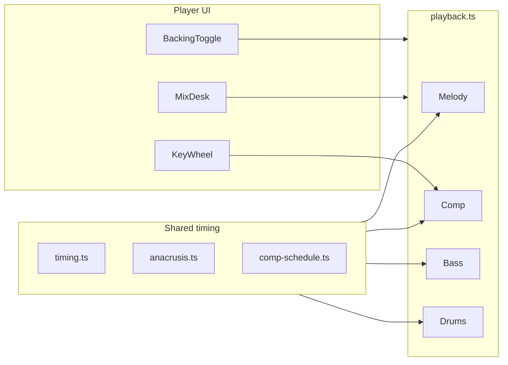

# Jazz Lines Player

Play and chain examples from *Mel Bay's Complete Book of Jazz Guitar Lines & Phrases* (Sid Jacobs), pages 21–23.

Two examples can be joined when the **last note of one** matches the **first note of the next** (pitch class — octave ignored). When played back, the shared boundary note is only sounded once.

## Architecture at a glance

Playback is built on **Tone.js**. The melody, comp, bass, and drums share a single quarter-note timing grid (`timing.ts`, `anacrusis.ts`, `comp-schedule.ts`). Tone Transport sets BPM; each part schedules notes with absolute `triggerAttackRelease` times so pickup bars, swing, and loop repeats stay aligned.



| Layer | Role |
|-------|------|
| **Player UI** | Key wheel, transport (Play line, Backing toggle), SQ-style mix desk |
| **Melody** | Nylon guitar, flute, or piano — the chained idiom line |
| **Comp** | Rootless ii–V–I piano (or nylon guitar when melody is piano) on & of 2 and & of 4 |
| **Bass** | Fingered electric bass on beats 1 and 3 (root / fifth) |
| **Drums** | Hi-hat on 2 and 4; swung jazz ride pattern |
| **Shared timing** | Anacrusis count-in, pickup alignment, swing offsets, loop re-schedule |

With **Backing** off, only the melody plays. With it on, comp, bass, and drums schedule together under the full line.

## Run locally

```bash
cd jazz-lines-app
npm install
npm run dev
```

Open the URL shown in the terminal (usually http://localhost:5173).

## Add your book's examples

Edit `src/data/examples-p21-23.ts`. Each example looks like:

```ts
{
  id: 'p21-ex1',
  page: 21,
  number: 1,
  label: 'Page 21, Ex. 1',
  notes: [
    { pitch: 'E4', duration: '8n' },  // eighth note
    { pitch: 'G4', duration: '8n' },
    { pitch: 'B4', duration: '4n' }, // quarter note
  ],
}
```

**Pitch**: scientific notation (`C4`, `Bb3`, `F#5`).

**Duration**: Tone.js values — `16n` (16th), `8n` (8th), `4n` (quarter), `2n` (half), `1n` (whole), dotted like `8n.` .

Replace the placeholder entries with the exact lines from your book. The join graph updates automatically from start/end notes.

## How chaining works

1. Click **Add to line** on any example (or play it first with **Play**).
2. The app shows **Can join next** — examples whose first note equals your line's last note.
3. Keep adding until no matches remain, or clear and start over.
4. **Play line** plays the full chained phrase.
